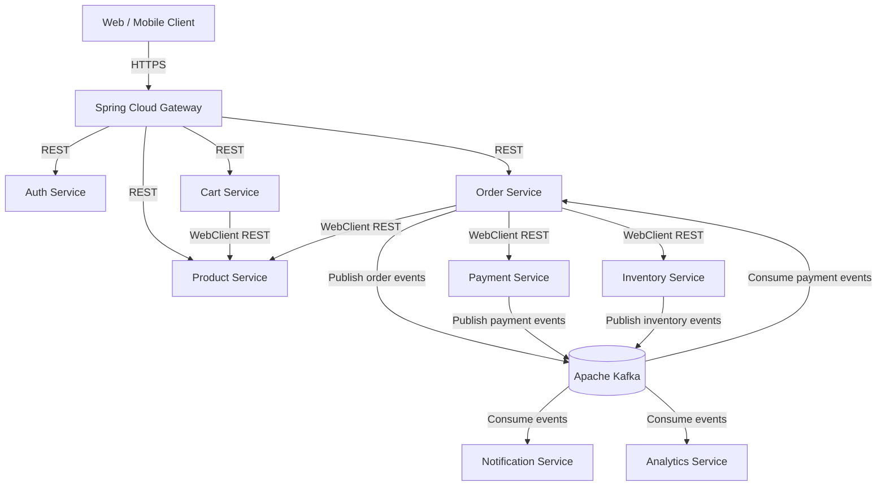

# Communication Architecture Diagram

```mermaid
flowchart TB
    Client[Web / Mobile Client]
    Gateway[Spring Cloud Gateway]

    Auth[Auth Service]
    Product[Product Service]
    Cart[Cart Service]
    Order[Order Service]
    Inventory[Inventory Service]
    Payment[Payment Service]

    Kafka[(Apache Kafka)]

    Notification[Notification Service]
    Analytics[Analytics Service]

    Client -->|HTTPS| Gateway

    Gateway -->|REST| Auth
    Gateway -->|REST| Product
    Gateway -->|REST| Cart
    Gateway -->|REST| Order

    Cart -->|WebClient REST| Product

    Order -->|WebClient REST| Product
    Order -->|WebClient REST| Inventory
    Order -->|WebClient REST| Payment

    Order -->|Publish order events| Kafka
    Payment -->|Publish payment events| Kafka
    Inventory -->|Publish inventory events| Kafka

    Kafka -->|Consume events| Notification
    Kafka -->|Consume events| Analytics
    Kafka -->|Consume payment events| Order
```