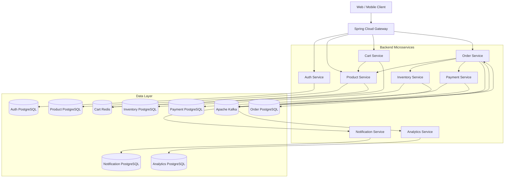

# Final System Architecture

```mermaid
flowchart TB
    Client[Web / Mobile Client]
    Gateway[Spring Cloud Gateway]

    subgraph Services[Backend Microservices]
        Auth[Auth Service]
        Product[Product Service]
        Cart[Cart Service]
        Order[Order Service]
        Inventory[Inventory Service]
        Payment[Payment Service]
        Notification[Notification Service]
        Analytics[Analytics Service]
    end

    subgraph Storage[Data Layer]
        AuthDB[(Auth PostgreSQL)]
        ProductDB[(Product PostgreSQL)]
        CartRedis[(Cart Redis)]
        InventoryDB[(Inventory PostgreSQL)]
        OrderDB[(Order PostgreSQL)]
        PaymentDB[(Payment PostgreSQL)]
        NotificationDB[(Notification PostgreSQL)]
        AnalyticsDB[(Analytics PostgreSQL)]
        Kafka[(Apache Kafka)]
    end

    Client --> Gateway

    Gateway --> Auth
    Gateway --> Product
    Gateway --> Cart
    Gateway --> Order

    Cart --> Product
    Order --> Product
    Order --> Inventory
    Order --> Payment

    Auth --> AuthDB
    Product --> ProductDB
    Product --> CartRedis
    Cart --> CartRedis
    Inventory --> InventoryDB
    Order --> OrderDB
    Payment --> PaymentDB
    Notification --> NotificationDB
    Analytics --> AnalyticsDB

    Order --> Kafka
    Payment --> Kafka
    Inventory --> Kafka

    Kafka --> Notification
    Kafka --> Analytics
    Kafka --> Order
```
